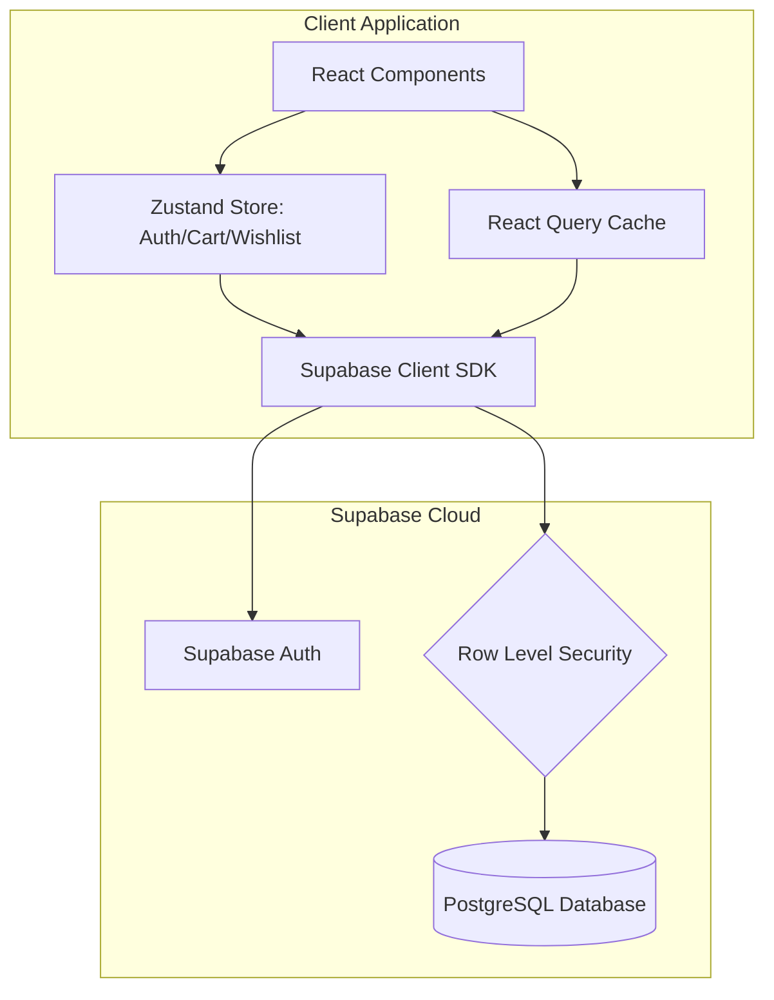

# Supabase Integration Specification

*   **Date:** 2026-06-26
*   **Status:** Approved
*   **Target Stack:** Vite + React + TypeScript + Zustand + React Query + Tailwind CSS v4

---

## 1. Background & Context
The current application is a client-side React Single Page Application (SPA). All resources (products, categories, testimonial reviews) are loaded from static TypeScript files in the `src/data/` directory. State changes such as adding items to the cart, modifying a wishlist, or submitting contact forms are currently transient or mocked.

This document describes the design and plan to integrate **Supabase** as the backend database, authentication provider, and security layer for the entire application.

---

## 2. Architecture Diagram



---

## 3. Database Schema (DDL SQL)

We will provision the following tables, triggers, and foreign keys in the Supabase PostgreSQL database:

```sql
-- Enable UUID extension
create extension if not exists "uuid-ossp";

-- 1. PROFILES (Linked with auth.users)
create table public.profiles (
  id uuid references auth.users on delete cascade primary key,
  email text not null,
  full_name text,
  created_at timestamp with time zone default timezone('utc'::text, now()) not null
);

-- Trigger to automatically create a profile when a new user signs up
create or replace function public.handle_new_user()
returns trigger as $$
begin
  insert into public.profiles (id, email, full_name)
  values (
    new.id, 
    new.email, 
    coalesce(new.raw_user_meta_data->>'full_name', '')
  );
  return new;
end;
$$ language plpgsql security definer;

create trigger on_auth_user_created
  after insert on auth.users
  for each row execute procedure public.handle_new_user();

-- 2. PRODUCTS
create table public.products (
  id uuid default gen_random_uuid() primary key,
  name text not null,
  description text,
  price numeric not null check (price >= 0),
  image_url text,
  category text,
  stock integer default 0 check (stock >= 0),
  rating numeric default 0 check (rating >= 0 and rating <= 5),
  reviews_count integer default 0 check (reviews_count >= 0),
  details jsonb,
  is_featured boolean default false,
  created_at timestamp with time zone default timezone('utc'::text, now()) not null
);

-- 3. CART ITEMS
create table public.cart_items (
  id uuid default gen_random_uuid() primary key,
  user_id uuid references public.profiles(id) on delete cascade not null,
  product_id uuid references public.products(id) on delete cascade not null,
  quantity integer default 1 check (quantity > 0) not null,
  created_at timestamp with time zone default timezone('utc'::text, now()) not null,
  unique (user_id, product_id)
);

-- 4. WISHLIST ITEMS
create table public.wishlist_items (
  id uuid default gen_random_uuid() primary key,
  user_id uuid references public.profiles(id) on delete cascade not null,
  product_id uuid references public.products(id) on delete cascade not null,
  created_at timestamp with time zone default timezone('utc'::text, now()) not null,
  unique (user_id, product_id)
);

-- 5. CONTACT SUBMISSIONS
create table public.contact_submissions (
  id uuid default gen_random_uuid() primary key,
  name text not null,
  email text not null,
  subject text,
  message text not null,
  created_at timestamp with time zone default timezone('utc'::text, now()) not null
);
```

---

## 4. Row Level Security (RLS) Policies

We enforce strict security at the database layer using Row Level Security (RLS).

```sql
-- Enable RLS on all tables
alter table public.profiles enable row level security;
alter table public.products enable row level security;
alter table public.cart_items enable row level security;
alter table public.wishlist_items enable row level security;
alter table public.contact_submissions enable row level security;

-- Profiles Policies
create policy "Allow public read-access to profiles" on public.profiles
  for select using (true);

create policy "Allow users to update own profile" on public.profiles
  for update using (auth.uid() = id);

-- Products Policies
create policy "Allow public read-access to products" on public.products
  for select using (true);

-- Cart Items Policies
create policy "Allow users to read own cart" on public.cart_items
  for select using (auth.uid() = user_id);

create policy "Allow users to insert into own cart" on public.cart_items
  for insert with check (auth.uid() = user_id);

create policy "Allow users to update own cart" on public.cart_items
  for update using (auth.uid() = user_id);

create policy "Allow users to delete from own cart" on public.cart_items
  for delete using (auth.uid() = user_id);

-- Wishlist Items Policies
create policy "Allow users to read own wishlist" on public.wishlist_items
  for select using (auth.uid() = user_id);

create policy "Allow users to insert into own wishlist" on public.wishlist_items
  for insert with check (auth.uid() = user_id);

create policy "Allow users to delete from own wishlist" on public.wishlist_items
  for delete using (auth.uid() = user_id);

-- Contact Submissions Policies
create policy "Allow anyone to submit contact messages" on public.contact_submissions
  for insert with check (true);
```

---

## 5. State Management & Offline Synchronization

### A. Authentication state
We will create `src/providers/SupabaseAuthProvider.tsx` to handle session listeners:
```typescript
supabase.auth.onAuthStateChange((event, session) => {
  if (session?.user) {
    useAppStore.getState().setUser({
      id: session.user.id,
      email: session.user.email!,
      name: session.user.user_metadata.full_name || '',
    });
  } else {
    useAppStore.getState().setUser(null);
  }
});
```

### B. Cart and Wishlist Sync Strategy
*   **Guest Mode:** Items are stored in Zustand state and persistent in browser local storage.
*   **User Mode:** Items are queried from and written to the database.
*   **Conversion (Merge on Log In):** When a user logs in, any existing local cart items and wishlist items will be upserted to Supabase, then local storage is cleared.

---

## 6. Implementation Checklist
- [ ] Install `@supabase/supabase-js` npm dependency.
- [ ] Setup env variables (`.env.example` and `.env`).
- [ ] Build the Supabase client helper (`src/lib/supabase.ts`).
- [ ] Create the auth context/provider.
- [ ] Connect [LoginForm.tsx](file:///home/aswin/programming/vscode/celestialabs/vigrahakart/src/pages/auth/components/LoginForm.tsx) and [RegisterForm.tsx](file:///home/aswin/programming/vscode/celestialabs/vigrahakart/src/pages/auth/components/RegisterForm.tsx) to Supabase authentication functions.
- [ ] Update state management (`src/store/useAppStore.ts`) to handle DB synchronization for Cart & Wishlist.
- [ ] Migrate products query hooks to fetch from Supabase.
- [ ] Connect the Contact Form submission to the database.
- [ ] Provide SQL schema file for database setup.
